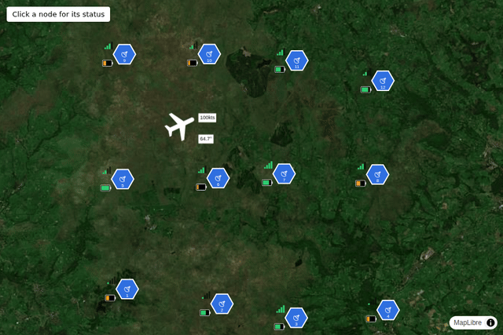
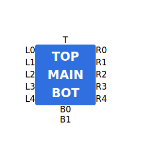

# ICTK

**ICTK** (ICon ToolKit) is a React component library for composing map-marker icons — frame, fill, center icon, modifiers, and amplifiers — loosely generalized from NATO's own guidance for map icons. It's built for one specific job: dropping real, interactive icons onto WebGL map libraries like [MapLibre GL JS](https://maplibre.org/) and [deck.gl](https://deck.gl/) as live DOM markers, not rasterized bitmaps.

```tsx
import { Icon, SquareFrame } from '@tingard/ictk';
import '@tingard/ictk/style.css';

<Icon
  frame={<SquareFrame fill="#c0392b" />}
  icon={<span>+</span>}
  modifierTop={<span>A</span>}
  modifierBottom={<span>2</span>}
  amplifiers={{ T: <span>Alpha-1</span> }}
/>;
```

<p align="center"></p>

<p align="center"><em>The <a href="./examples/maplibre">examples/maplibre</a> app, running — every icon above is a real <code>maplibregl.Marker</code>, not a mockup.</em></p>

## Is ICTK for you?

Use it if you want composable, interactive map-marker icons — real DOM elements with real click/hover handlers — on MapLibre GL or deck.gl's DOM-overlay path, and you're fine building on a small set of primitives rather than a complete symbol set.

Consider something else if:

- **You need full NATO/military symbology fidelity** (echelon marks, the complete shape vocabulary, standard affiliation colors). [`milsymbol`](https://spatialillusions.com/milsymbol/) implements the actual standard properly; ICTK deliberately doesn't.
- **You need thousands of markers rendered performantly.** DOM markers (what both MapLibre's `Marker` and deck.gl's DOM-overlay path use) don't scale the way a WebGL `IconLayer` does — for large point clouds, a rasterized icon layer is the right tool.
- **You just need one simple marker.** A plain `maplibregl.Marker` with your own `<div>` is less machinery than pulling in a whole composition system.

**Testing honesty:** every CSS layout invariant (box size, centering, overflow behavior, amplifier positioning) is verified in real Chromium via Playwright, not jsdom — but only Chromium so far. Cross-browser behavior (Firefox, Safari/WebKit) is currently unverified; treat it as such until that's added.

## Contents

- [Is ICTK for you?](#is-ictk-for-you)
- [Why real DOM markers](#why-real-dom-markers)
- [Concepts](#concepts)
- [Sizing and anchoring](#sizing-and-anchoring)
- [Built-in frames](#built-in-frames)
- [Extending: custom frames](#extending-custom-frames)
- [Map integration](#map-integration)
- [Fail-loud, not silent](#fail-loud-not-silent)
- [API reference](#api-reference)
- [Development](#development)
- [Status and non-goals](#status-and-non-goals)

## Why real DOM markers

Both MapLibre and deck.gl support mounting arbitrary DOM content as map markers — `maplibregl.Marker({ element })` and deck.gl's `@deck.gl/react` DOM-overlay children both position a real DOM node over the map using the same projection math the map itself uses. That's different from something like a WebGL `IconLayer`, which needs a pre-rasterized bitmap in a texture atlas.

Because ICTK targets that DOM-marker path specifically, `<Icon />` is just a normal React component. Mount it into whatever element you hand the map library, and it works — no SVG-to-bitmap pipeline, no texture atlas, and pointer events (click, hover) work exactly as they would anywhere else in your app, because they *are* anywhere else in your app.

```tsx
import { createRoot } from 'react-dom/client';
import { Marker } from 'maplibre-gl';
import { Icon, SquareFrame } from '@tingard/ictk';

const el = document.createElement('div');
createRoot(el).render(<Icon frame={<SquareFrame fill="#c0392b" />} icon={<span>A</span>} />);
new Marker({ element: el, anchor: 'center' }).setLngLat([2.35, 48.86]).addTo(map);
```

See [`examples/maplibre`](./examples/maplibre) for a complete, running example with multiple markers, click handling, and notes on a couple of `maplibre-gl` v6 + Vite integration gotchas that had nothing to do with ICTK itself but are worth knowing about.

## Concepts

An icon is composed from five independent pieces:

1. **Frame** — the overall backdrop shape (square, circle, hexagon, ...). A frame is a *pure* backdrop: it never receives or renders icon/modifier content, so every frame behaves identically regardless of shape.
2. **Fill** — the frame's background: a solid CSS color, a gradient, an image, or texture-atlas coordinates.
3. **Icon** — the central glyph. Always rendered exactly centered in the frame, regardless of which modifiers are present.
4. **Modifiers** — small content above (`modifierTop`) and below (`modifierBottom`) the icon, still inside the frame.
5. **Amplifiers** — supporting text or sub-icons in 13 fixed positions around the frame's edges, keyed by position code.

```
        T
  L0        R0
  L1        R1
  L2  frame R2
  L3        R3
  L4        R4
        B0
        B1
```

<p align="center"></p>

Amplifiers are positioned via CSS Grid and are allowed to overflow outside the icon's own box — they never affect its size (see [Fail-loud, not silent](#fail-loud-not-silent)).

## Sizing and anchoring

`<Icon size={n} />` sets the icon's overall footprint in pixels (default **32**, chosen to sit closer to conventional map-marker sizing — Leaflet/Mapbox/Google's default pins run roughly 25–41px — than a larger default would). Icon/modifier/amplifier font sizes scale proportionally with `size`; there's deliberately no minimum-legibility clamp, since a consumer who needs a guaranteed text size for specific content can just style that content directly (every content prop accepts arbitrary `ReactNode`).

The frame always renders at exactly `size x size`, anchored at its own center — amplifiers can spill outside that box, but never change its dimensions. That makes the center a stable anchor point for `maplibregl.Marker`'s default `anchor: 'center'` and deck.gl's DOM-overlay positioning. There's currently only the one anchor mode; alternatives (e.g. a flagpole-style bottom anchor) aren't implemented until a real use case needs one.

## Built-in frames

| Component | Shape | Notes |
| --- | --- | --- |
| `SquareFrame` | Square | |
| `CircleFrame` | Circle | |
| `HexagonFrame` | Flat-top hexagon | |
| `DiamondFrame` | Diamond | An SVG `polygon`, not a `transform: rotate`d square, so content inside stays upright |
| `CupFrame` | Flat top, rounded bottom | The sea-subsurface silhouette from NATO's own guidance |
| `CapFrame` | Rounded top, flat bottom | The air silhouette from that same guidance; the inverse of `CupFrame` |

Each accepts `fill` and `stroke` props (a `Fill` — solid color, gradient, image, or atlas coordinates — and a `Stroke`; see the API reference below).

ICTK intentionally stops there. NATO's own guidance for map icons defines a much larger vocabulary of frame shapes — diamonds with corner ticks, houses, inverted houses, quatrefoils ("clovers"), and more (see `static/app6d-standard-identifiers.png` for the full reference table) — but ICTK isn't aiming for full parity with it. If you need full-fidelity military symbology, a dedicated library like [`milsymbol`](https://spatialillusions.com/milsymbol/) is a better fit. ICTK's value is being a lightweight, generalized composition system — and since a frame is just a component, nothing stops you from building the shapes you need yourself (see below).

## Extending: custom frames

A frame is any component that renders something carrying the `ictk-frame` class — that's the only real requirement, and it's a runtime/CSS contract, not something TypeScript enforces. `FrameBase` is the supported way to satisfy it without needing to know that detail. Frame shapes are real SVG (`rect`/`circle`/`polygon`/`path`), not CSS `clip-path` on a `div` — a CSS `border` never follows an angular `clip-path` correctly (it's drawn on the element's original rectangular border-box regardless of the clip), while SVG `stroke` follows any shape's actual outline:

```tsx
import { FrameBase, type FrameBaseProps } from '@tingard/ictk';

export function HouseFrame({ fill, stroke }: Pick<FrameBaseProps, 'fill' | 'stroke'>) {
  return (
    <FrameBase
      fill={fill}
      stroke={stroke}
      shape={{ kind: 'path', d: 'M0,40 L50,0 L100,40 L100,100 L0,100 Z' }}
    />
  );
}
```

`FrameBase` applies the `ictk-frame` class (grid placement and sizing within `<Icon />`), resolves `fill` into an SVG paint (a color, or a generated `<linearGradient>`/`<pattern>` for gradient/image/atlas fills), and renders `shape` — a normalized 0-100 viewBox coordinate space, so it scales correctly regardless of the icon's actual `size`. `shape` accepts `{ kind: 'rect', rx? }`, `{ kind: 'circle' }`, `{ kind: 'polygon', points }`, or `{ kind: 'path', d }`, matching the underlying SVG elements directly. This is deliberately the whole contract: it depends on nothing from `<Icon />` internals, so a set of custom frames (a full NATO-shape-vocabulary pack, a client-specific icon set, whatever) is easy to publish as its own separate package that depends on `@tingard/ictk` for `FrameBase`/`FrameBaseProps` and nothing else. `fill`/`stroke` are just `FrameBase`'s convenience, not something `<Icon />` requires — a custom frame is free to skip `FrameBase` entirely and render its own SVG/DOM, as long as it carries the `ictk-frame` class.

For any regular polygon (pentagon, octagon, whatever NATO shape you're missing), skip hand-plotting `points` and use `nGonPoints`, the same helper `SquareFrame`/`HexagonFrame` are built on:

```tsx
import { FrameBase, nGonPoints, type FrameBaseProps } from '@tingard/ictk';

const PENTAGON_POINTS = nGonPoints(5, { rotation: -90 }); // point straight up

export function PentagonFrame({ fill, stroke }: Pick<FrameBaseProps, 'fill' | 'stroke'>) {
  return <FrameBase fill={fill} stroke={stroke} shape={{ kind: 'polygon', points: PENTAGON_POINTS }} />;
}
```

`nGonPoints(n, { cx, cy, radius, rotation })` places `n` vertices around a center (defaulting to the middle of the 0-100 box, radius 50 — touching the box edges), `rotation` in degrees along SVG's angle convention. It's worth noting `radius` is the distance to each *vertex* (the circumradius), not to an edge's midpoint — that's why `SquareFrame` uses `radius: 50 * Math.SQRT2` to reach the corners of an axis-aligned box, and it's why `SquareFrame` no longer has rounded corners (that used `<rect rx>`; a plain `polygon` can't round corners the same way).

## Fail-loud, not silent

Oversized content (a modifier string too long for its icon, an amplifier that doesn't fit) stays **visible and overflowing**, rather than being clipped. The layer holding icon/modifier content uses `min-width`/`min-height: 0` rather than `overflow: hidden` specifically for this reason: silently clipping content would hide a misconfigured marker from the developer, which is the opposite of fail-safe. If something looks broken, it's supposed to look broken.

## API reference

### `<Icon />`

| Prop | Type | Default | Notes |
| --- | --- | --- | --- |
| `frame` | `ReactElement` | *required* | A built-in frame or any custom component satisfying the `ictk-frame` contract. |
| `icon` | `ReactNode` | — | Centered content. |
| `modifierTop` | `ReactNode` | — | |
| `modifierBottom` | `ReactNode` | — | |
| `amplifiers` | `Partial<Record<AmplifierPosition, ReactNode>>` | — | Keyed by position code (`T`, `L0`–`L4`, `R0`–`R4`, `B0`, `B1`). Only present keys render. |
| `size` | `number` | `32` | Overall footprint in pixels. |
| `className` | `string` | — | |
| `style` | `CSSProperties` | — | |

### `Fill`

```ts
type Fill =
  | string // any CSS color
  | { type: 'gradient'; stops: { offset: number; color: string }[]; angle?: number }
  | { type: 'image'; src: string }
  | {
      type: 'atlas';
      src: string;
      x: number;
      y: number;
      width: number;
      height: number;
      naturalWidth: number; // the atlas image's own pixel dimensions
      naturalHeight: number;
    };
```

### `Stroke`

```ts
interface Stroke {
  color: string;
  width: number; // a fixed pixel width regardless of icon size
}
```

### `FrameBase`

```ts
interface FrameBaseProps {
  fill?: Fill;
  stroke?: Stroke;
  shape: FrameShape;
}

type FrameShape =
  | { kind: 'rect'; rx?: number }
  | { kind: 'circle' }
  | { kind: 'polygon'; points: string }
  | { kind: 'path'; d: string };
```

## Development

This is a pnpm workspace: the library lives at the repo root (`ictk`), with runnable examples under `examples/`.

```sh
pnpm install

pnpm --filter @tingard/ictk typecheck
pnpm --filter @tingard/ictk lint
pnpm --filter @tingard/ictk test        # vitest (jsdom component tests) + real-Chromium
                                # Playwright tests for every CSS Grid layout
                                # invariant — box size never grows with
                                # content, amplifiers never overlap, the icon
                                # stays centered regardless of modifiers.
                                # jsdom alone can't catch any of these; it
                                # doesn't do real layout. (Chromium only for
                                # now — see "Is ICTK for you?" above.)
pnpm --filter @tingard/ictk build

pnpm --filter @ictk/example-maplibre dev   # live example at localhost:5173
```

Dependency versions are gated by a 14-day `minimumReleaseAge` policy in `pnpm-workspace.yaml` (a cheap, high-leverage defense against supply-chain attacks — most malicious npm releases are caught and yanked within days), and install/postinstall scripts are denied by default except for an explicit `allowBuilds` allowlist.

## Status and non-goals

- **Pre-1.0, not yet published to npm. License not finalized** (leaning MIT).
- **Not aiming for full parity with NATO's own guidance for map icons** — see [Built-in frames](#built-in-frames). This is a deliberate, standing scope decision, not a "not implemented yet."
- **Tested in real Chromium via Playwright, not yet cross-browser** — see [Is ICTK for you?](#is-ictk-for-you).
- **One anchor mode only** (frame center) — see [Sizing and anchoring](#sizing-and-anchoring).
- **MapLibre GL integration is verified working** end-to-end (real map, real markers, real clicks — see `examples/maplibre`). deck.gl's DOM-overlay pattern is understood conceptually but not yet built or tested against a real deck.gl app.
